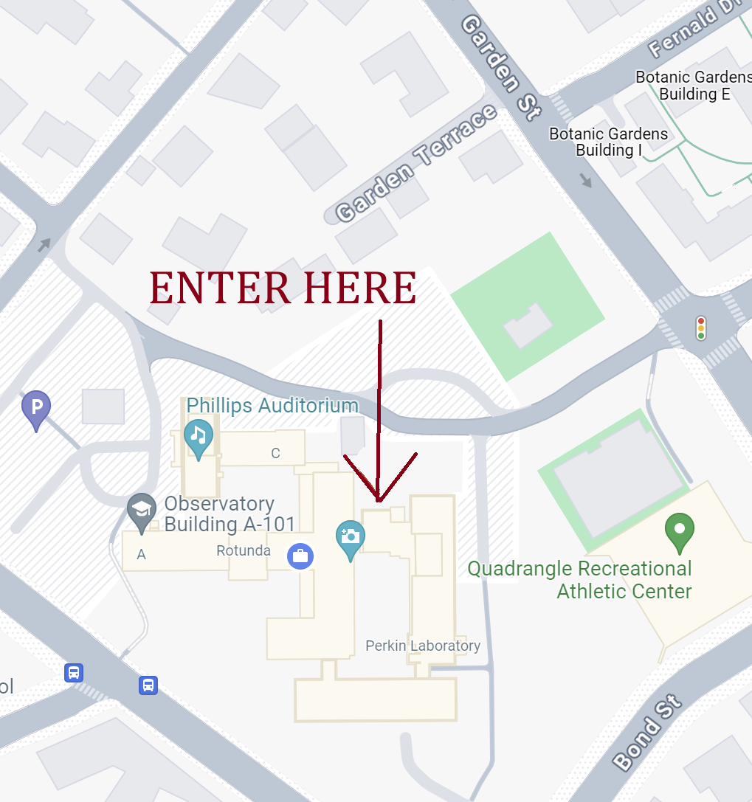

- [Connection](#connection)
- [Location](#location)
- [Accomodation](#accomodation)
- [Travel](#travel)
- [Workshop Materials](#workshop-materials)

# Connection
Most communication during the workshop will happen through this slack space, which you can join via (create slack space!)

The workshop will be held in person and online. Zoom connection info will be made available to participants using the echoIA email list (in Google groups) and on the [schedule](https://docs.google.com/spreadsheets/d/1MzWjizfxwfxuQwbc8JpLRSLAT5XSdYw--pe49tZjV_s/edit?usp=sharing).

If you would like to be added to the echo-IA github organization, which will host echo-IA-related repositories, please enter your github username [here](https://forms.gle/i44GjtfSNJ7YUWjK6).

While all scheduled talks will be streamed, not all work sessions will have a virtual option and some may be only virtual. As the workshop is intented to be highly interactive and self-organized, the in-person/online availability will depend on the organizers of individual sessions and the level of interest.

Recordings of sessions and slides / notes will be added to the [schedule](https://docs.google.com/spreadsheets/d/1MzWjizfxwfxuQwbc8JpLRSLAT5XSdYw--pe49tZjV_s/edit?usp=sharing).

More regarding the logistics of this workshop including restaurant recommendations, things to do around Durham, weather and emergency contact information, and information regarding the DESC Forecasting / Intrinsic Alignment Workshop the preceeding week can be found [here](https://docs.google.com/document/d/1wRNW-F0kugHyQtSf4kbNp_56vq0bwQDVyoOChMNkFNM/edit?usp=sharing). 

# Location 

The CAROLINA Workshop will be held at the Mary Duke Biddle Trent Semans Center for Health Education, located at [8 Searle Center Dr, Durham, NC 27710](https://www.google.com/maps?client=firefox-b-1-d&sca_esv=c48dc88e8766c10f&output=search&q=mary+duke+biddle+trent+semans+center+for+health+education&source=lnms&fbs=AIIjpHxU7SXXniUZfeShr2fp4giZ1Y6MJ25_tmWITc7uy4KIehZSPZtq-ywdxHK81a_1UWmZHKJ6oqjHuUktiabrRPeHJMsvLtH8GNAdGHXBY55oOcQgKj85Zt8V0rJBqqM2jRLVOpwhMemqaFe_3JlhfsrbwzIEzn71Fr66wXjX2eFkeBIwcD5fliuxdO7E3jZZwFrqx1YiZL2nX8zmQMDFMNA9nTTfsA&entry=mc&ved=1t:200715&ictx=111). 

The main workshop sessions will take place in this building on **the fourth floor**. Primarily, TSCHE 4067 Classroom #4 and TSCHE 4030 Conference Room #4A. Signs inside will direct you to conference registration. 

Alternative work spaces: the Physics Building is located at 120 Science Dr, a short walk from the Center for Health Education. In addition, the Perkins and Bostock Libraries are nearby and unlocked during the day. We additionally encourage virtual participants to liberally connect over slack and virtual breakout rooms.

  

Change this image to a map of center for health education ^

# Travel

The nearest airport is [Raleigh-Durham (RDU)](https://www.rdu.com/maps-and-directions/). 

In addition to Uber / Lyft, there are some public transport options around the Research Triangle. The GoTriangle bus system (for transportation between Durham, Chapel Hill, and Raleigh) currently charges [fare](https://gotriangle.org/fares-passes). However, within Durham, the GoDurham bus system and the Duke University bus system are **free**. 

# Accomodation

Here are some reccomended hotels in the area:

[JB Duke Hotel](https://jbdukehotel.reservationstays.com/hotels/PlO11pnG?utm_source=adwords_semro&utm_campaign=G%3ARS%3AUS%3APMAX%3ADSA-Chains%3AUS%3AEN&gad_campaignid=21191562182&expand_params=false&redirect_auth_retry=true), 230 Science Dr, Durham, NC 27708. This hotel is on campus, walking distance, and upscale. 

[The Lodge](https://www.lodgeatdumc.com/?gad_campaignid=12236737849), 2306 Elba St, Durham, NC 27705. This hotel is also walking distance, but budget-friendly. 

[Hilton Garden Inn](https://www.guestreservations.com/Hilton-Garden-Inn-Durham-University-Medical-Center/booking?utm_source=google&utm_medium=cpc&utm_campaign=973003610&gad_campaignid=973003610), 2102 West Main St, Durham, North Carolina, 27705. This hotel is near Ninth Street with good access to food and coffee. It is also on the H5 bus line to the workshop location. 

[AC Marriott](https://www.guestreservations.com/ac-hotel-by-marriott-durham/booking?utm_source=google&utm_medium=cpc&utm_campaign=1014862718&gad_campaignid=1014862718&ctTriggered=true), 2800 Erwin Rd, Durham, NC 27705. This is another walking distance hotel on the edge of campus which is more upscale. 

[Residence Inn](https://www.guestreservations.com/residence-inn-durham-mcphersonduke-university-medical-cntr/booking?utm_source=google&utm_medium=cpc&utm_campaign=834685359&gad_campaignid=834685359), 1108 West Main St, Durham, NC, 27701. This hotel is more affordable and on the 11 and 11b bus lines to campus. The location downtown near East Campus is around a lot of food and coffee options.

**Note:** During hotel checkout, be sure to **ask for an itemized receipt** (with your name, dates, and total amount). This is often **required for reimbursement**, especially by university or DOE policies. Even if you booked online, some funders (like DESC or Duke) may request this specific checkout receipt as proof of stay.

Airbnb is also an option: **Duke** is able to reimburse Airbnbs, as long as the receipt includes your name, dates, and full cost. Be sure to save your confirmation email and final receipt for reimbursement.

# Workshop Materials
Links to recordings and slides will be posted in the live [schedule](https://docs.google.com/spreadsheets/d/1MzWjizfxwfxuQwbc8JpLRSLAT5XSdYw--pe49tZjV_s/edit?usp=sharing).

